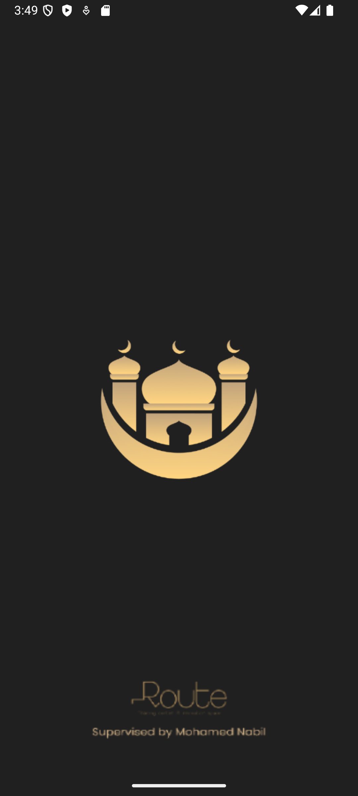
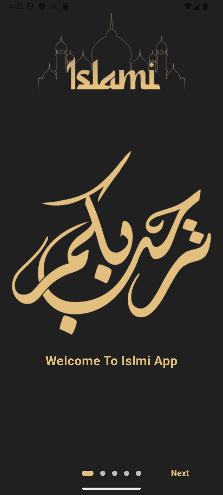
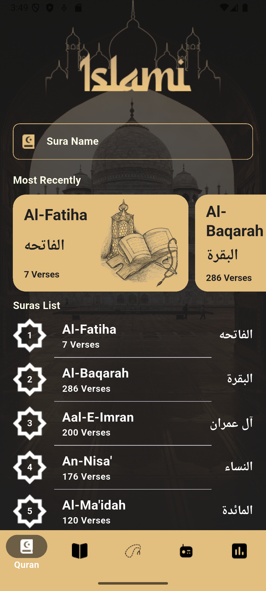
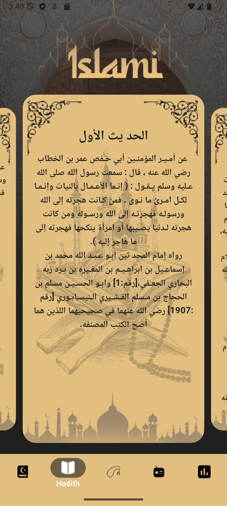
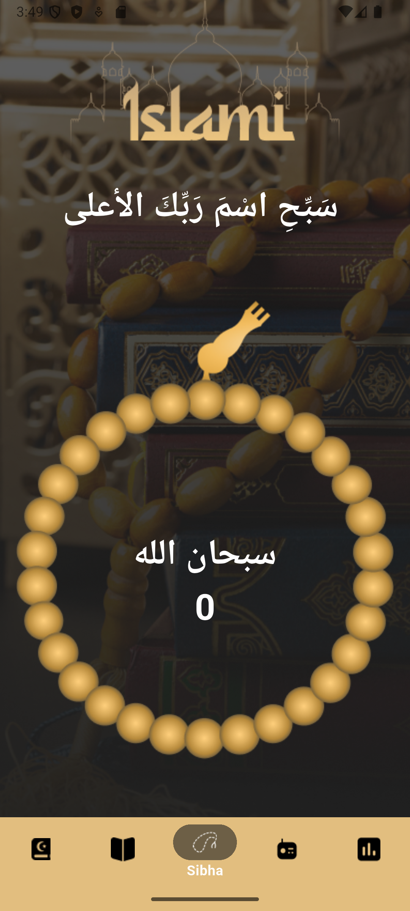
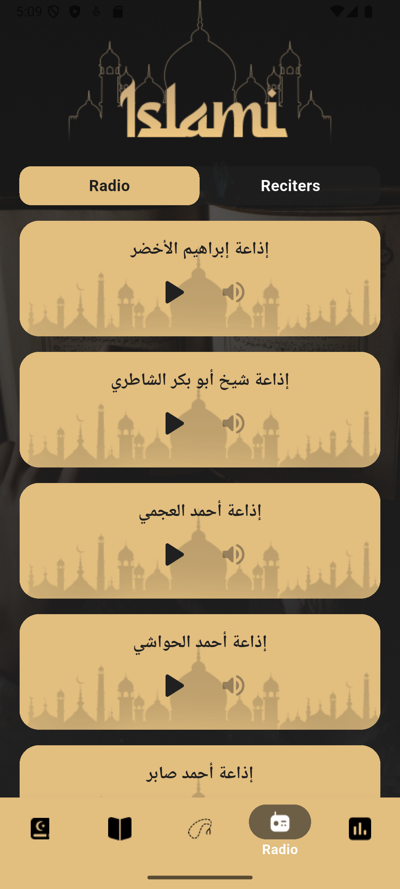
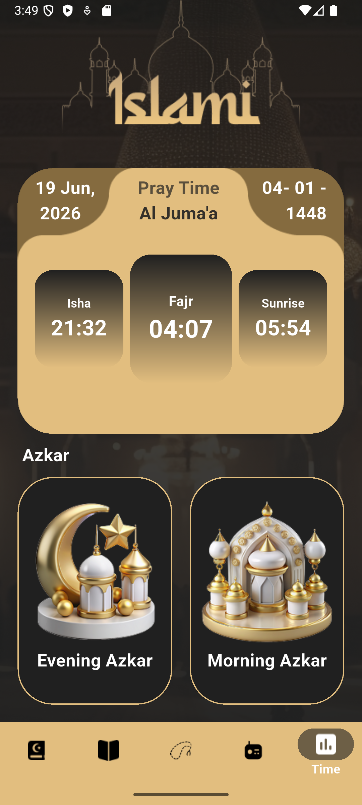

<div align="center">

<!--  -->

# 🕌 Islami

### *Your Complete Islamic Companion — All in One App*

[](https://flutter.dev)
[](https://dart.dev)
[](https://bloclibrary.dev)
[](LICENSE)
[](https://flutter.dev)

> A beautifully crafted Flutter application bringing together the Holy Quran, Hadith, Tasbeeh, Islamic Radio, and Azkar — all wrapped in an elegant, dark-themed UI.

</div>

---

## 📱 App Preview
<table>
  <tr>
    <th>Splash</th>
    <th>Onboarding</th>
    <th>Home — Quran</th>
  </tr>
  <tr>
    <td></td>
    <td></td>
    <td></td>
  </tr>
</table>

<table>
  <tr>
    <th>Hadith</th>
    <th>Sibha</th>
    <th>Radio</th>
    <th>Azkar</th>
  </tr>
  <tr>
    <td></td>
    <td></td>
    <td></td>
    <td></td>
  </tr>
</table>

<!-- > 🎬 **Demo Video**

[](https://youtu.be/YOUR_VIDEO_ID) -->

## 📥 Download APK

[Latest Release](https://drive.google.com/drive/u/1/folders/1xYoWu2BLSX8zM8AKjwgJF1UeeOGF8d7w)
---

## ✨ Features

### 📖 Quran
- Browse all 114 Surahs with clean Arabic text
- Full Surah detail reading screen
- Data loaded locally — works 100% offline

### 📜 Hadith
- Access a comprehensive Hadith collection
- Dedicated Hadith details screen for focused reading
- Fully offline with locally bundled assets

### 📿 Sibha (Tasbeeh)
- Digital Tasbeeh counter with a beautiful interactive UI
- Dedicated immersive background per tab
- Track your Dhikr with precision

### 📻 Islamic Radio
- Stream live Islamic radio stations
- Browse Quran reciters and listen to recitations
- Powered by real-time audio streaming

### 🕐 Azkar & Prayer Times
- Morning, Evening, and situational Azkar
- Dedicated Azkar detail reading screen
- Organized and easy to navigate

### 🚀 Onboarding Experience
- Smooth, first-time user onboarding flow
- Remembers returning users and skips intro automatically

---
<!-- 
## 🏗️ Architecture

Islami is built with a **scalable, reactive architecture** following clean separation of concerns:

```
Presentation Layer  →  Screens & Tabs (Flutter Widgets)
       ↕
State Management   →  Bloc / Cubit (flutter_bloc)
       ↕
Data Layer         →  Local Assets + Dio HTTP Client
       ↕
Persistence        →  SharedPreferences (via Cache helper)
```

- **Pattern:** Feature-first folder structure
- **State Management:** BLoC / Cubit for predictable, testable state
- **Networking:** `Dio` for robust HTTP handling (Radio streams, Reciters API)
- **Caching:** `SharedPreferences` wrapped in a custom `Cache` utility class

--- -->

## 🎨 UI & Design Highlights

- 🌙 **Dark/Elegant Theme** — Custom `AppColor` palette with main, secondary, and creamy tones
- 🖼️ **Dynamic Backgrounds** — Home screen background changes per active tab (`quran_bg.png`, `radio_bg.png`, `sibha_bg.png`, etc.)
- 🔤 **Global Typography** — Consistent `TextTheme` (Headline, Body, Title) defined at the `MaterialApp` level
- ⚡ **Native Splash Screen** — Polished launch experience using `flutter_native_splash`

---

## 🧰 Tech Stack

| Package | Version | Purpose |
|---|---|---|
| `flutter_bloc` / `bloc` | ^9.0.0 | Reactive state management |
| `dio` | ^5.8.0+1 | HTTP networking & API calls |
| `shared_preferences` | ^2.5.2 | Lightweight local key-value storage |
| `audioplayers` | ^6.2.0 | Audio streaming for Radio tab |
| `introduction_screen` | ^3.1.14 | Onboarding walkthrough |
| `carousel_slider_plus` | ^7.1.0 | Carousel UI components |
| `toggle_switch` | ^2.3.0 | Interactive toggle controls |
| `flutter_native_splash` | ^2.4.4 | Native splash screen customization |
| `cupertino_icons` | ^1.0.8 | iOS-style iconography |

---

## 📁 Project Structure

```
islami/
├── lib/
│   ├── helper/
│   │   ├── cache/
│   │   │   └── cache.dart            # SharedPreferences wrapper
│   │   └── colors/
│   │       └── app_color.dart        # Centralized color constants
│   ├── models/
│   │   ├── azkar_model.dart
│   │   ├── hadith_model.dart
│   │   ├── radio_model.dart
│   │   ├── reciters_model.dart
│   │   ├── surah_model.dart
│   │   └── time_model.dart
│   ├── screens/
│   │   ├── home_screen.dart          # Bottom nav host screen
│   │   ├── onboarding_screen.dart    # First-time intro
│   │   └── tabs/
│   │       ├── quran/                # Quran list & Surah details
│   │       ├── hadith/               # Hadith list & details
│   │       ├── radio/                # Radio & Reciters UI
│   │       ├── time/                 # Prayer Times & Azkar
│   │       └── sibha_tab.dart        # Tasbeeh counter
│   └── main.dart                     # Entry point & Theme setup
│
└── assets/
    ├── images/                       # Backgrounds, icons, UI assets
    └── files/
        ├── suras/                    # Quran text files
        ├── hadeeth/                  # Hadith text files
        └── azkar/                    # Azkar text files
```

---

## 🚀 Getting Started

### Prerequisites

Make sure you have the following installed:

- [Flutter SDK](https://flutter.dev/docs/get-started/install) (**>=3.x**)
- [Dart SDK](https://dart.dev/get-dart) (**^3.6.1**)
- Android Studio / Xcode (for device/emulator setup)

### Installation

**1. Clone the repository:**
```bash
git clone https://github.com/YOUR_USERNAME/islami.git
cd islami
```

**2. Install dependencies:**
```bash
flutter pub get
```

**3. Run the app:**
```bash
# For debug mode
flutter run

# For a specific device
flutter run -d chrome        # Web
flutter run -d emulator-5554 # Android emulator
```

**4. Build for release:**
```bash
# Android APK
flutter build apk --release

# iOS (macOS only)
flutter build ios --release
```

---

## 🔧 Configuration

### Splash Screen
To regenerate the native splash screen after making changes to `flutter_native_splash.yaml`:
```bash
dart run flutter_native_splash:create
```

### Assets
All Quran, Hadith, and Azkar content is bundled locally under `assets/files/`. No internet connection is required for reading features.

---

## 🤝 Contributing

Contributions are warmly welcome! Here's how to get started:

1. **Fork** the repository
2. **Create** a feature branch: `git checkout -b feature/your-feature-name`
3. **Commit** your changes: `git commit -m 'feat: add amazing feature'`
4. **Push** to your branch: `git push origin feature/your-feature-name`
5. **Open** a Pull Request

Please follow the existing code style and BLoC architecture patterns.

---

## 📄 License

This project is licensed under the **MIT License** — see the [LICENSE](LICENSE) file for details.

---

<div align="center">

Made with ❤️ and Flutter

*"And We have certainly made the Quran easy for remembrance, so is there any who will remember?"*  
— **Quran 54:17**

⭐ If you find this project useful, please consider giving it a star!

</div>
